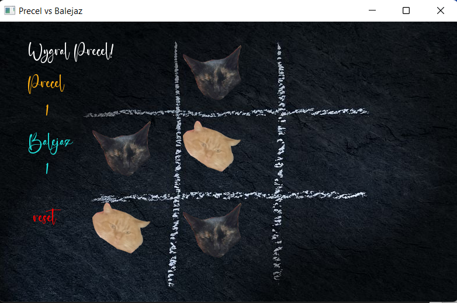

# Simple Tic-Tac-Toe Game

## Description

Simple Tic-Tac-Toe Game is a popular strategy game with a twist. Instead of using X and O symbols, adorable cat faces are used as markers. The game was developed using the SFML library. It features a user-friendly interface and intuitive gameplay. The objective of the game is to align three cat faces in a row, either horizontally, vertically, or diagonally, to win the game. Players take turns placing their cat faces on the grid until a winner is determined or the game ends in a draw.

## How to Play

1. Download the release file and run the .exe program.
2. The game will start automatically.
3. Players take turns selecting empty cells on the grid to place their cat faces.
4. The first player to align three cat faces in a row wins the game.
5. If all cells are filled and no player has won, the game ends in a draw.

## Technologies Used

- SFML library 

## Author

The game was created by: Piotrek538

